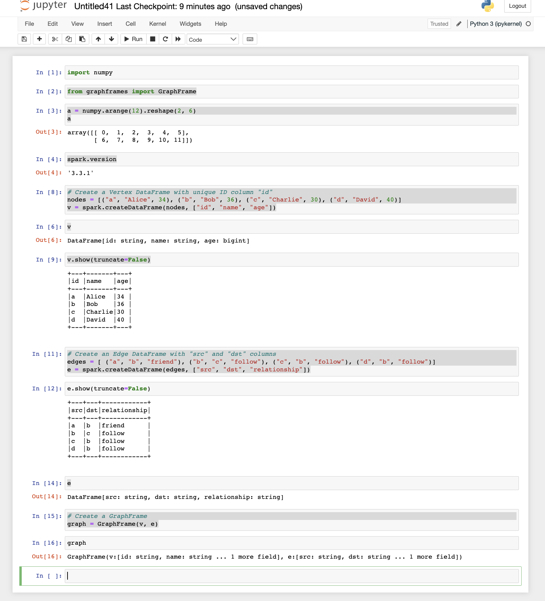

# Using Graphframes with Jupyter

It is desirable to show and tell PySpark in Jupyter.
To  install PySpark and Jupyter Notebook , you may
refer it [here](https://www.sicara.fr/blog-technique/2017-05-02-get-started-pyspark-jupyter-notebook-3-minutes).

Also, it is desirable to use [GraphFrames](https://graphframes.github.io/graphframes/docs/_site/index.html) 
package in PySpark. 

Some of my students had a problem using GraphFrames in Jupyter.
That is why I am posting this wiki-how to address the problem.

This is how I did it: to use GraphFrames in Jupyter:

1. Make sure that the `numpy` package is installed
   properly on the specific version of python which
   you are using for PySpark,
   
2. You might have multiple copies/versions of Python,
   but make sure, you select the Python, in which `numpy`
   package has been installed properly,
   
3. To make sure you are doing okay, make sure that inside
   Jupyter, you can run the following (two imports)
   successfully (without any error):

		import numpy
		from graphframes import GraphFrame

This is my script for invoking Jupyter and then using GraphFrames successfully:
(update the script accordingly)

##  Script to use GraphFrames inside Jupyter:
You should update the paths accordingly
	# 1. define your environment variables
	export PATH=/home/mparsian/Library/Python/3.9/bin:$PATH
	export SPARK_HOME="/home/mparsian/spark-3.3.1"
	export PATH=$SPARK_HOME/bin:$PATH
	export PYSPARK_PYTHON="/Library/Frameworks/Python.framework/Versions/3.9/bin/python3"
	export PYSPARK_DRIVER_PYTHON=jupyter
	export PYSPARK_DRIVER_PYTHON_OPTS='notebook'
	export GF_PKG="graphframes:graphframes:0.8.2-spark3.2-s_2.12"
	# 2. launch jupyter/pyspark
	$SPARK_HOME/bin/pyspark --packages ${GF_PKG}

